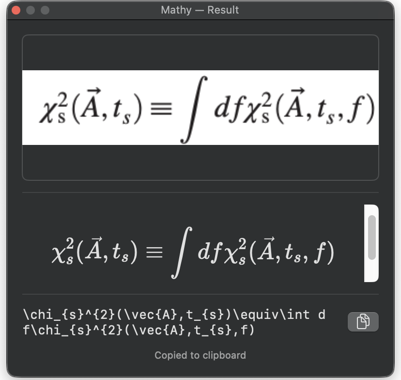

# Getting Started

## Install

1. Download **Mathy.dmg** from [Releases](https://github.com/FaroutYLq/mathy/releases)
2. Open the DMG and drag **Mathy** to **Applications**
3. **Important:** Do NOT double-click to open on first launch — macOS will show a "Not Opened" warning and offer to move it to Trash. Instead, **right-click** (or Control-click) Mathy.app and choose **Open**, then click **Open** in the dialog. This is only required once.

!!! warning "If you accidentally clicked Move to Trash"
    Retrieve Mathy from the Trash (open Trash in Dock, drag it back to Applications), then right-click > **Open** as described above.

On first launch, Mathy automatically installs the Python OCR engine and downloads the model (~200MB). A setup window shows progress — no terminal needed. See [Onboarding & Python Setup](onboarding.md) for details on what happens behind the scenes.

### Requirements

- **macOS 13+** (Ventura or later)
- **Python 3.8+** (pre-installed on most Macs, or `brew install python3`)

## Usage

Once running, Mathy appears as a calligraphic **M** icon in the menu bar.

{ width="400" }

- **Cmd+Shift+M** — capture a screen region and convert to LaTeX
- Click the menu bar icon to see server status, recent history, and settings
- Converted LaTeX is automatically copied to your clipboard
- A preview popup shows the captured image alongside rendered LaTeX

## Settings

Access settings from the menu bar dropdown (gear icon):

| Setting | Description |
|---|---|
| **Capture hotkey** | Remap the global shortcut (default: Cmd+Shift+M) |
| **Auto-copy** | Automatically copy LaTeX to clipboard after capture |
| **Launch at login** | Start Mathy when you log in (via SMAppService) |
| **Reinstall OCR engine** | Delete the managed venv and re-run onboarding setup |

## Permissions

Mathy needs **Screen Recording** permission to capture screen regions. macOS will prompt you the first time you capture. If capture stops working after an app update, remove Mathy from System Settings > Privacy & Security > Screen Recording and re-add it.
